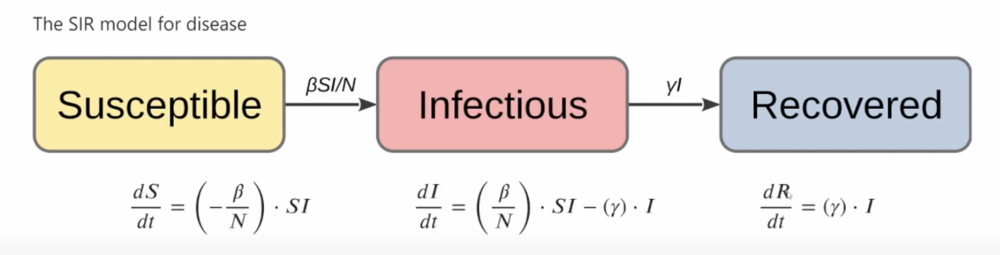
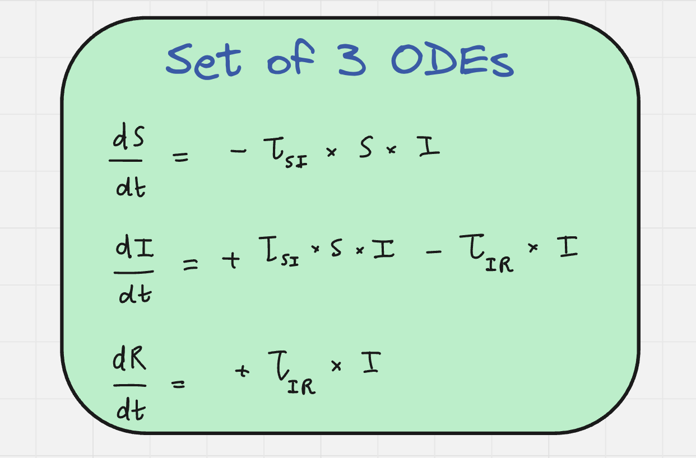
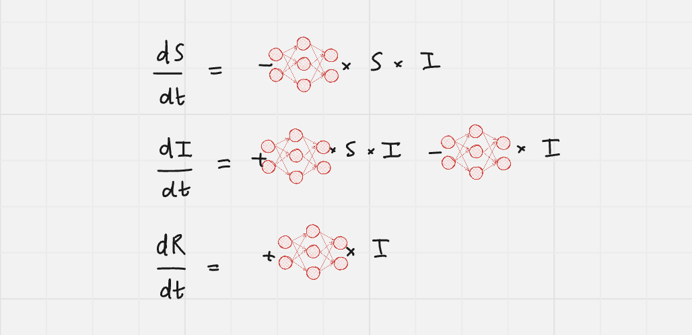

# SIR Model (Scientific ML)

## 📚 What is Scientific ML?
**Scientific Machine Learning (SciML)** is an interdisciplinary field that combines traditional **scientific computing** (such as differential equations and physics-based models) with **machine learning (ML)** techniques to create models that can learn from data while respecting physical laws and domain knowledge.

### 🔑 Key Aspects:
- **Hybrid Modeling:** Integrates data-driven ML models with physics-based models to improve prediction accuracy and interpretability.
- **Data Efficiency:** Utilizes prior scientific knowledge to reduce the need for large datasets.
- **Explainability:** Ensures interpretable results by incorporating scientific principles.
- **Solving Complex Problems:** Applied in diverse fields like climate modeling, computational fluid dynamics, systems biology, and more.

---

## 🦠 Understanding the SIR Model

The **SIR model** is a fundamental compartmental model used in epidemiology to describe the spread of infectious diseases in a population. It divides the population into three compartments:

### 1. 🟢 S (Susceptible)
Individuals who have not yet been infected but are vulnerable to the disease. As the infection spreads, people transition from the **S (Susceptible)** category to the **I (Infected)** category.

### 2. 🔴 I (Infected)
Individuals who are currently infected and can spread the disease to susceptible individuals. They either recover or die, transitioning to the **R (Recovered/Removed)** category.

### 3. 🟣 R (Recovered/Removed)
Individuals who have recovered from the disease and are now immune (cannot be infected again), or those who have died and can no longer spread the infection.

---

## 📊 Mathematical Formulation
The SIR model is governed by a system of three Ordinary Differential Equations (ODEs):

---

## Universal Differential Equation (UDE)

Universal Differential Equations (UDEs) combine traditional differential equations with neural networks to create flexible models that can learn complex dynamics from data. Instead of discarding known parameters, UDEs incorporate known parameters and use neural networks to model only the **unknown or hard-to-model parameters**.

**Differential Equations + Neural Networks = Universal Differential Equations (UDE)**

---
** How weights are updated

The following represent the gradient descent update rule for weights in a machine learning model, typically used in linear regression or neural networks. Here's a breakdown:

**θ₁new = θ₁old - η * (∂MSE / ∂θ₁)**

Where:
- η is the learning rate (step size).
- ∂MSE / ∂θ is the gradient of the Mean Squared Error (MSE) with respect to each parameter.

## 🚀 Applications
- **Epidemiology:** Understanding and predicting the spread of diseases.
- **Public Health Policy:** Designing intervention strategies to control outbreaks.
- **Vaccine Modeling:** Estimating the impact of vaccination campaigns.

